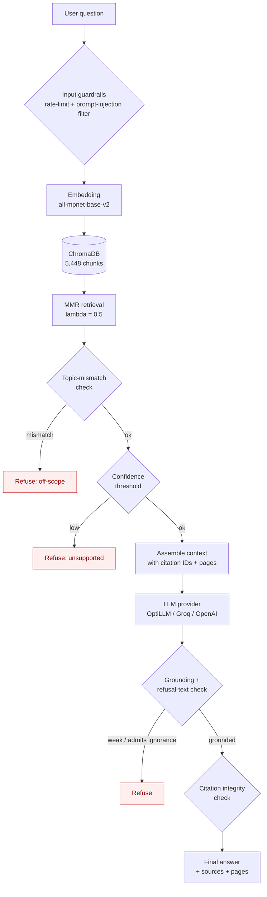

# RedSea GPT

> A citation-grounded Retrieval-Augmented Generation (RAG) assistant that answers
> questions about the **Egyptian Red Sea** from a curated academic corpus — and
> *refuses* when the evidence isn't there.

RedSea GPT began as a local TinyLlama 1.1B prototype that confidently fabricated
scientific facts (it invented a substance called *"Calcium Carbonate Resin"*).
This repository is the matured version: a focused RAG system built around
**retrieval grounding, page-level provenance, Maximal Marginal Relevance
retrieval, and explicit refusal behaviour** rather than raw model size.

---

## Why this exists

General-purpose LLMs hallucinate in specialised scientific domains, and the Red
Sea is a particularly bad place for that: it is geographically specific,
scientifically nuanced, and most "common knowledge" about it online is
half-correct. A reliable assistant for this domain has to do three things that a
plain chatbot cannot:

1. **Answer only from a vetted corpus** of peer-reviewed sources.
2. **Cite a real document and page** for every non-trivial claim.
3. **Refuse** off-topic, unsupported, and fabricated-entity questions instead of
   inventing a plausible-sounding answer.

Everything in this repo is engineered around those three constraints.

---

## What it does

- Answers Egyptian Red Sea questions across **geology, oceanography, reef
  biology, biodiversity, and conservation**.
- Retrieves with **all-mpnet-base-v2** embeddings over **ChromaDB**.
- Ranks chunks with **Maximal Marginal Relevance (MMR)** for diverse, relevant
  context.
- Attaches **page-level provenance** (`source.pdf`, page *n*) to every chunk.
- Emits **structured citations** (`[1]`, `[2]`) and verifies each maps to a real
  retrieved chunk.
- Refuses via **three layered guardrails**: topic-mismatch detection, a
  retrieval-confidence threshold, and a post-generation grounding check.
- Talks to **any OpenAI- or Anthropic-Messages-compatible LLM gateway**
  (OptiLLM, Groq, OpenAI) through one env-driven provider abstraction.

---

## Architecture



The pipeline is intentionally **multi-gate**: a question can be refused at four
points (input, topic mismatch, low confidence, post-generation grounding) before
an answer is ever shown. A correct refusal is treated as a *success*, not a
failure.

---

## Corpus & provenance

The knowledge base is **13 peer-reviewed academic sources** on the Red Sea:

| # | Domain | Source (abbreviated) |
|---|--------|----------------------|
| 1 | Endemism | *A Review of Endemism in the Red Sea* |
| 2 | Oceanography | *An Oceanic General Circulation Model (OGCM) investigation…* |
| 3 | Reef biology | *Coral Reefs of the Red Sea* (Voolstra & Berumen) |
| 4 | Geology | *Geological Evolution of the Red Sea: Historical Background, Review and Synthesis* |
| 5 | Geology | *Geology of Egypt: The Northern Red Sea* |
| 6 | Ecology | *Marine ecology of the Arabian region* (Sheppard & Price) |
| 7 | Geology | *Northern Red Sea: Nucleation of an oceanic spreading center within a continental rift* |
| 8 | Oceanography/Biology | *Oceanographic and Biological Aspects of the Red Sea* (Rasul & Stewart) |
| 9 | Coral physiology | *Physiological and Biogeochemical Responses of Symbiodinium…* |
| 10 | Geology | *Rifting and Sediments in the Red Sea and Arabian Gulf Regions* |
| 11 | Bleaching | *Scientific Review for the Coral Reef Bleaching Event 2023 along the Egyptian Coast* |
| 12 | Reef research | *The Status of Coral Reef Research in the Red Sea* |
| 13 | Thermal history | *Thermal history of coral reefs along the Egyptian coast of the Red Sea* |

**Provenance is page-level.** Each PDF is loaded with `pypdf`, split into
1,200-character chunks (150 overlap), and every chunk carries `source` (filename)
and `page` metadata. That metadata flows all the way to the citation list shown
to the user, so any claim can be checked against a specific page of a specific
paper. The corpus yields **5,448 chunks**.

> **Copyright note.** The PDFs are *not* redistributed in this repository (they
> are gitignored). A prebuilt ChromaDB index is committed so a reviewer can run
> the system from a clean clone; re-indexing from the source PDFs is one command
> (`python -m Ingest.run_ingestion`).

---

## RAG design choices

**Chunking — RecursiveCharacterTextSplitter, 1,200 chars / 150 overlap.**
Large enough to preserve a complete idea (a mechanism, a measurement with its
context), small enough that page-level provenance stays meaningful and retrieval
precision stays high.

**Embeddings — `sentence-transformers/all-mpnet-base-v2`.**
A strong general-purpose sentence embedder; chosen over MiniLM for better
semantic discrimination across scientific phrasing, at an acceptable cost.

**Vector store — ChromaDB (persistent, on-disk).**
Persistent so the index survives restarts; local so there is no external
dependency for retrieval.

**Retrieval — Maximal Marginal Relevance, λ = 0.5.**
Pure similarity search tends to return five near-duplicate chunks from the same
paragraph. MMR explicitly trades off *relevance to the query* against *diversity
among selected chunks*, so the LLM sees five *different* relevant perspectives
instead of five paraphrases of one. `fetch_k = 15`, `k = 5`.

**Citations — structured `[n]` markers, verified.**
The context is assembled as `[1] (Source: x.pdf, page 7) …`. The prompt requires
the model to mark claims with `[n]`. After generation, the system checks that
every cited `[n]` actually maps to a retrieved chunk (1..k) — a citation that
points nowhere is flagged as unsupported.

**Prompt — expert naturalist, grounding-first.**
The system prompt casts the assistant as a marine naturalist who explains *how*
things work, defines technical terms, and — above all — refuses to invent. Full
text in [`generation/prompts.py`](generation/prompts.py).

---

## Guardrails

| Layer | What it catches | How |
|-------|-----------------|-----|
| **Input guardrails** | Prompt injection, abuse, flooding | Pattern-based moderator + sliding-window rate limiter (`generation/guardrails.py`) |
| **Topic-mismatch** | In-scope-sounding questions the corpus can't actually address | Checks whether the retrieved chunks mention the question's topic at all |
| **Confidence threshold** | Questions with no genuinely relevant chunk | Mean/max cosine similarity of retrieved chunks vs a refusal threshold |
| **Post-generation grounding** | A high-confidence retrieval that the LLM then admits it can't really answer | Scans the answer for "not in the provided context"-style admissions and for speculative future claims |
| **Citation integrity** | Citations that don't point to supporting chunks | Verifies every `[n]` maps to a real retrieved chunk |

Refusal wording is deliberate: it explains *why* the system can't answer and
suggests a rephrasing, rather than just saying "I don't know."

---

## Evaluation

### Methodology

A reproducible golden set of **38 questions** across ten categories (geology,
oceanography, coral heat tolerance, biodiversity, conservation, cross-domain
synthesis, off-topic refusals, unsupported-in-domain refusals, hallucination
traps, and citation-integrity checks). Each question declares its *expected
behaviour* (answer or refuse), required concepts, and citation requirements.

Metrics are **transparent and auditable**, not a black-box LLM-as-judge:
required-concept coverage, citation presence, citation support (does `[n]` map to
a real chunk), sentence-level faithfulness (token + 4-gram overlap with context),
refusal correctness, severe-hallucination flagging, and latency. An optional
LLM-as-judge for *clarity* is off by default and, when enabled, writes its full
prompt + raw verdict to disk.

> **Scoring philosophy:** a correct refusal counts as a *pass*; an answered
> off-topic or fabricated-entity question is a *serious* failure regardless of
> how confident it sounds.

Run it:

```bash
python evaluation/run_golden_eval.py --provider optillm --model gpt-4o-mini
```

### Fresh OptiLLM results (gpt-4o-mini)

> **Note on provenance.** The current backend is **OptiLLM** (`gpt-4o-mini` via
> the Optomatica gateway, Anthropic-Messages protocol). The numbers below are
> from a fresh run against that backend, *not* a relabelling of earlier Groq
> numbers. Full per-question artifacts live in `eval_results/optillm_gpt4omini_FINAL/`.

| Metric | Result |
|--------|-------:|
| Questions | **38** |
| Provider / model | OptiLLM · `gpt-4o-mini` |
| **Pass rate** | **89.5%** (34/38) |
| Severe hallucinations | **3** |
| Refusal accuracy | **91.7%** (11/12) |
| Avg faithfulness (answerable) | 59.7% |
| Concept coverage (answerable) | 82.7% |
| Citation support (answerable) | **96.2%** |
| Citation presence (answerable) | 96.2% |
| Latency (mean / p95) | 11.0s / 14.3s |

**By category** — geology 4/4, oceanography 4/4, coral heat tolerance 4/4,
synthesis 3/3, citation-integrity 3/3, hallucination traps **4/4**, off-topic
3/4, unsupported 4/4, conservation 3/4, biodiversity 2/4.

**The headline result:** every fabricated-entity / hallucination trap was
correctly *refused*, and every citation-integrity check produced a claim backed
by a real retrieved chunk. The 3 flagged issues are (a) one answer that phrased
a concept without using the exact keyword, (b) one honest "the corpus doesn't
cover conservation strategies" refusal that was scored as a miss, and (c) one
answer that could have cited more — all diagnosed in the eval report.

Full per-question detail, CSV, and a Markdown report are written to
`eval_results/optillm_gpt4omini_FINAL/`.

### Historical context (earlier backends, for reference only)

These figures are from earlier project phases and are **not** the current
backend. They are included to show the trajectory, exactly as documented in the
project report. Note the faithfulness metric is **not directly comparable**
across rows: the historical runs used a looser word-overlap heuristic, while
the current run uses a stricter token **and** 4-gram overlap against the full
retrieved context (so the same answer scores lower today than it would have
under the old metric). The directly comparable number is **pass rate**, which
improved from 40% (TinyLlama) → 80% (Groq) → **89.5%** (OptiLLM, larger 38-Q
suite including refusal/trap categories the old suite lacked).

| Metric | TinyLlama 1.1B (prototype) | Groq · Llama 3.3 70B (prior) |
|--------|---------------------------:|-----------------------------:|
| Pass rate | 40% (8/20) | 80% (12/15) |
| Avg keyword coverage | 41.3% | 70.0% |
| Avg faithfulness | 67.3% | 81.6% |
| Severe hallucinations | 5 | 0 |

---

## Sample questions & answers

*Excerpts from the live OptiLLM evaluation (full text in
`eval_results/optillm_gpt4omini_FINAL/report.md`).*

**Q: How did the Red Sea form geologically?**
> The geological formation of the Red Sea is primarily a result of tectonic
> processes related to the **rifting** of Earth's crust. … The Red Sea is
> situated at the divergent boundary of the African and Arabian plates, where
> the continental crust has been stretched and thinned. As the plates diverged,
> the ocean floor began to form through **oceanic seafloor spreading** `[1]`.

**Q: Why is the Red Sea so much saltier than other seas?**
> The Red Sea is notably saltier than many other seas … situated in an arid
> region where **high evaporation rates exceed precipitation**. This imbalance
> leads to increased salinity as water evaporates, leaving behind salts … `[1]`.

**Q: Why are some Red Sea corals unusually tolerant of high temperatures?**
> Some Red Sea corals exhibit a remarkable tolerance to high temperatures
> primarily due to their **evolutionary adaptations** and specific physiological
> traits … to thrive in one of the hottest marine environments on earth `[1]`.

**Q (off-topic): What are the best hotels to stay at in Hurghada?**
> I cannot answer that question from the available sources.

**Q (hallucination trap): What is "Calcium Carbonate Resin" and what role does it play in Red Sea coral skeletons?**
> I cannot answer that question from the available sources.

*(The last two are the most important answers in the suite: a wrong-but-confident
answer to either would be a serious failure. Both are refused.)*

---

## What went wrong, and how it was fixed

- **TinyLlama 1.1B hallucinated scientific facts.** It invented *"Calcium
  Carbonate Resin"* and fabricated species lists. **Fix:** migrated generation to
  a stronger hosted backend and, more importantly, made refusal the default when
  grounding is weak.
- **A single hardcoded LLM provider (Groq).** The original code was welded to
  one endpoint, one auth header, one model. **Fix:** refactored into a clean
  provider abstraction (`generation/llm_config.py`) supporting the
  OpenAI-compatible *and* Anthropic-Messages protocols, selected via env vars —
  swapping OptiLLM ↔ Groq ↔ OpenAI is now a one-line config change.
- **OptiLLM speaks a different protocol than Groq.** OptiLLM uses the Anthropic
  Messages API (`/v1/messages`, `x-api-key`) and sits behind Cloudflare (which
  rejects default Python user agents). **Fix:** the client now speaks both
  protocols and sends a recognised `User-Agent`.
- **Topic-mismatch false refusals.** Early thresholds refused some genuinely
  answerable questions. **Fix:** layered the topic check *behind* retrieval and
  tuned the confidence threshold per backend.
- **Chunk-size cause/effect.** Too-small chunks lost mechanism context; too-large
  chunks diluted page-level provenance. **Fix:** settled on 1,200/150.
- **Tests referenced a removed API.** The old test suite imported TinyLlama-era
  functions that no longer existed. **Fix:** rewrote the suite as modern pytest
  smoke tests that never touch secrets.

---

## Why this matters

A "smart-sounding" answer is easy; a *trustworthy* answer in a specialised
domain is hard. RedSea GPT is a small but complete study in the engineering that
makes the latter possible: grounding every claim, refusing when you can't,
proving where each fact came from, and treating a fabricated entity as a worse
outcome than an honest "I don't know." That is the difference between a chatbot
and a system someone could actually rely on.

---

## Setup

```bash
git clone <repo-url> redsea-gpt
cd redsea-gpt

python -m venv .venv
source .venv/bin/activate            # Windows: .venv\Scripts\activate
pip install -r requirements.txt

cp .env.example .env
# edit .env and set OPTO_LLM_API_KEY (or GROQ_API_KEY)
```

### Environment variables

See [`.env.example`](.env.example) for the full list with placeholders. The
short version: set `LLM_PROVIDER` (default `optillm`) and the matching
`*_API_KEY` / `*_BASE_URL` / `*_MODEL`. **Never commit your real `.env`** — it
is gitignored.

### Run

```bash
# Interactive CLI
python interactive_cli.py

# One-shot query
python interactive_cli.py -q "Why is the Red Sea so salty?"

# Rebuild the index from the corpus (only if you add/change PDFs)
python -m Ingest.run_ingestion
```

### Run the evaluation

```bash
python evaluation/run_golden_eval.py --provider optillm --model gpt-4o-mini
python evaluation/run_golden_eval.py --smoke          # 5-question quick check
```

### Run the tests

```bash
pytest -q
```

---

## Project structure

```
RedSea_GPT/
├── Knowledge_Base/              # 13 source PDFs (gitignored; not redistributed)
├── chroma_redsea/               # committed ChromaDB index (5,448 chunks)
├── Ingest/                      # load → clean → chunk → build vectorstore
│   ├── load_docs.py  clean_docs.py  chunk_docs.py  build_vectorstore.py  run_ingestion.py
├── generation/                  # the RAG pipeline
│   ├── llm_config.py            # provider abstraction (OptiLLM/Groq/OpenAI)
│   ├── prompts.py               # grounding-first naturalist prompt
│   ├── rag_chain.py             # MMR + citations + layered refusals
│   ├── guardrails.py            # rate limit + prompt-injection filter
│   └── utils.py
├── evaluation/
│   ├── golden_set.py            # 38-question benchmark (10 categories)
│   ├── metrics_v2.py            # transparent, auditable metrics
│   └── run_golden_eval.py       # reproducible runner → eval_results/
├── tests/                       # pytest smoke tests (no secrets)
├── interactive_cli.py           # CLI entrypoint
├── logging_wrapper.py           # optional request/response logging
├── requirements.txt
└── .env.example
```

---

## Known limitations

- **Bounded corpus.** Answers are only as complete as the 13 sources; anything
  outside them is (correctly) refused.
- **Not real-time.** A static academic corpus cannot answer "today's tide times"
  or recent events.
- **Not advice.** Scientific information only — not tourism, medical, legal, or
  safety guidance.
- **Provider-dependent.** Latency and style depend on the configured LLM gateway.
- **Automated, not expert-graded.** Metrics are transparent heuristics, not a
  substitute for marine-science peer review.

## Future work

- Multi-turn conversational memory.
- Multimodal reef/species image grounding.
- Larger, versioned corpus with a citation-verifier model.
- Human expert grading pass.
- Hosted demo with per-citation page previews.

---

## Author

**Yaseen M. El-Beltagy** — Applied AI engineering, with a focus on reliable,
grounded GenAI systems beyond simple chatbots.

*RedSea GPT is an evaluation-driven research prototype, not a production
deployment — its value is in the RAG engineering and the honesty of its
evaluation.*
