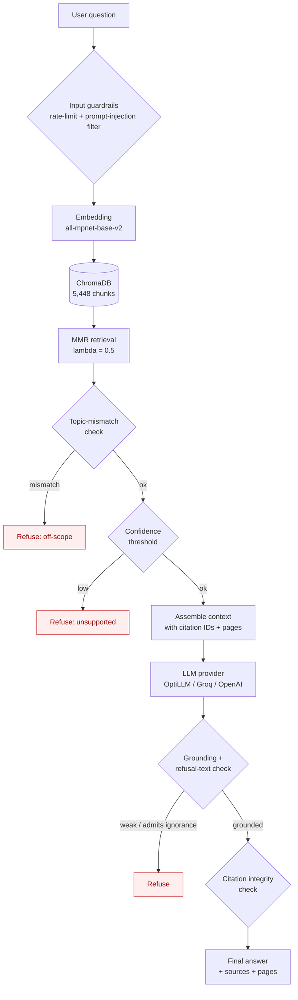
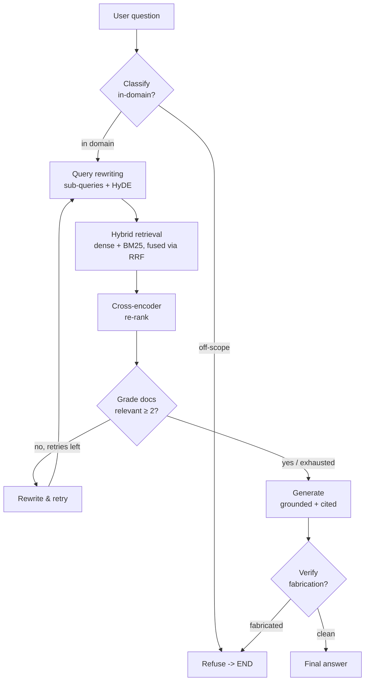

# RedSea GPT

> A citation-grounded Retrieval-Augmented Generation (RAG) assistant that answers
> questions about the **Egyptian Red Sea** from a curated academic corpus — and
> *refuses* when the evidence isn't there.

RedSea GPT began as a local TinyLlama 1.1B prototype that confidently fabricated
scientific facts (it invented a substance called *"Calcium Carbonate Resin"*).
This repository is the matured version: a focused RAG system built around
**retrieval grounding, page-level provenance, Maximal Marginal Relevance
retrieval, and explicit refusal behaviour** rather than raw model size.

---

## Why this exists

General-purpose LLMs hallucinate in specialised scientific domains, and the Red
Sea is a particularly bad place for that: it is geographically specific,
scientifically nuanced, and most "common knowledge" about it online is
half-correct. A reliable assistant for this domain has to do three things that a
plain chatbot cannot:

1. **Answer only from a vetted corpus** of peer-reviewed sources.
2. **Cite a real document and page** for every non-trivial claim.
3. **Refuse** off-topic, unsupported, and fabricated-entity questions instead of
   inventing a plausible-sounding answer.

Everything in this repo is engineered around those three constraints.

---

## What it does

- Answers Egyptian Red Sea questions across **geology, oceanography, reef
  biology, biodiversity, and conservation**.
- Retrieves with **all-mpnet-base-v2** embeddings over **ChromaDB**.
- Ranks chunks with **Maximal Marginal Relevance (MMR)** for diverse, relevant
  context.
- **Multiturn conversation memory**: follow-ups with pronouns and implicit
  references ("how deep is *it*?", "and what about its salinity?") are
  rewritten into self-contained questions before retrieval, so the system
  holds a real conversation rather than treating each turn in isolation.
- Attaches **page-level provenance** (`source.pdf`, page *n*) to every chunk.
- Emits **structured citations** (`[1]`, `[2]`) and verifies each maps to a real
  retrieved chunk.
- Refuses via **three layered guardrails**: topic-mismatch detection, a
  retrieval-confidence threshold, and a post-generation grounding check.
- Talks to **any OpenAI- or Anthropic-Messages-compatible LLM gateway**
  (OptiLLM, Groq, OpenAI) through one env-driven provider abstraction.

---

## Architecture



The pipeline is intentionally **multi-gate**: a question can be refused at four
points (input, topic mismatch, low confidence, post-generation grounding) before
an answer is ever shown. A correct refusal is treated as a *success*, not a
failure.

### Agentic mode: self-reflective CRAG on LangGraph

A second, more powerful pipeline — `RedSeaAgent` — implements the **CRAG /
Self-RAG** pattern as an explicit **LangGraph `StateGraph`** with conditional
edges. It can *self-correct*: it grades retrieved documents for relevance, and
if they are insufficient it rewrites the query and retries retrieval before
generating. Both modes share the same provider, prompt, and citation discipline.



The new components, each independently testable:

| Component | File | What it adds over baseline |
|---|---|---|
| **Hybrid retrieval** | `generation/retrievers.py` | Dense (`all-mpnet`) + sparse (BM25), fused by **Reciprocal Rank Fusion** (Cormack 2009, k=60). Catches exact terminology dense retrieval blurs. |
| **Query rewriting** | `generation/query_rewriter.py` | Sub-query decomposition + **HyDE** hypothetical-document embeddings (Gao 2023). Richer recall on multi-part questions. |
| **Cross-encoder re-rank** | `generation/reranker.py` | `bge-reranker-base` scores query+doc *jointly* for sharper precision. **Degrades gracefully** to fused order if the model can't load (offline / clean clone). |
| **Document grading** | `generation/graph.py` | LLM grades each retrieved doc 0/1 for relevance; low-relevance rounds trigger a rewrite+retry loop (bounded). |
| **Retrieval as tools** | `generation/tools.py` | Retrieval is exposed as genuine LangChain `@tool` functions — inspectable, reusable, agent-callable. |
| **Self-correction loop** | `generation/graph.py` | The graph *accumulates* evidence across retry rounds via a custom de-dup reducer (`Annotated[list, add_or_replace]`). |
| **Claim-level verification** | `generation/graph.py` + `evaluation/metrics_v2.py` | Post-generation fabrication check + an LLM-judge faithfulness metric (claim extraction → batched entailment, RAGAS-style, dependency-free). |

> **Why the verify-gate defaults off.** A post-hoc LLM verifier over-refuses
> legitimate paraphrase/synthesis (it flagged "Gondwana breakup" as ungrounded
> when the corpus *does* discuss rifting). The generator's grounding prompt is
> already the primary guardrail, so the verifier runs as an *observability*
> signal by default; set `strict_verify=True` for the ablation. This is a
deliberate, tested design decision — not a missing feature.

---

## Corpus & provenance

The knowledge base is **13 peer-reviewed academic sources** on the Red Sea:

| # | Domain | Source (abbreviated) |
|---|--------|----------------------|
| 1 | Endemism | *A Review of Endemism in the Red Sea* |
| 2 | Oceanography | *An Oceanic General Circulation Model (OGCM) investigation…* |
| 3 | Reef biology | *Coral Reefs of the Red Sea* (Voolstra & Berumen) |
| 4 | Geology | *Geological Evolution of the Red Sea: Historical Background, Review and Synthesis* |
| 5 | Geology | *Geology of Egypt: The Northern Red Sea* |
| 6 | Ecology | *Marine ecology of the Arabian region* (Sheppard & Price) |
| 7 | Geology | *Northern Red Sea: Nucleation of an oceanic spreading center within a continental rift* |
| 8 | Oceanography/Biology | *Oceanographic and Biological Aspects of the Red Sea* (Rasul & Stewart) |
| 9 | Coral physiology | *Physiological and Biogeochemical Responses of Symbiodinium…* |
| 10 | Geology | *Rifting and Sediments in the Red Sea and Arabian Gulf Regions* |
| 11 | Bleaching | *Scientific Review for the Coral Reef Bleaching Event 2023 along the Egyptian Coast* |
| 12 | Reef research | *The Status of Coral Reef Research in the Red Sea* |
| 13 | Thermal history | *Thermal history of coral reefs along the Egyptian coast of the Red Sea* |

**Provenance is page-level.** Each PDF is loaded with `pypdf`, split into
1,200-character chunks (150 overlap), and every chunk carries `source` (filename)
and `page` metadata. That metadata flows all the way to the citation list shown
to the user, so any claim can be checked against a specific page of a specific
paper. The corpus yields **5,448 chunks**.

> **Copyright note.** The PDFs are *not* redistributed in this repository (they
> are gitignored). A prebuilt ChromaDB index is committed so a reviewer can run
> the system from a clean clone; re-indexing from the source PDFs is one command
> (`python -m Ingest.run_ingestion`).

---

## RAG design choices

**Chunking — RecursiveCharacterTextSplitter, 1,200 chars / 150 overlap.**
Large enough to preserve a complete idea (a mechanism, a measurement with its
context), small enough that page-level provenance stays meaningful and retrieval
precision stays high.

**Embeddings — `sentence-transformers/all-mpnet-base-v2`.**
A strong general-purpose sentence embedder; chosen over MiniLM for better
semantic discrimination across scientific phrasing, at an acceptable cost.

**Vector store — ChromaDB (persistent, on-disk).**
Persistent so the index survives restarts; local so there is no external
dependency for retrieval.

**Retrieval — Maximal Marginal Relevance, λ = 0.5.**
Pure similarity search tends to return five near-duplicate chunks from the same
paragraph. MMR explicitly trades off *relevance to the query* against *diversity
among selected chunks*, so the LLM sees five *different* relevant perspectives
instead of five paraphrases of one. `fetch_k = 15`, `k = 5`.

**Citations — structured `[n]` markers, verified.**
The context is assembled as `[1] (Source: x.pdf, page 7) …`. The prompt requires
the model to mark claims with `[n]`. After generation, the system checks that
every cited `[n]` actually maps to a retrieved chunk (1..k) — a citation that
points nowhere is flagged as unsupported.

**Prompt — expert naturalist, grounding-first.**
The system prompt casts the assistant as a marine naturalist who explains *how*
things work, defines technical terms, and — above all — refuses to invent. Full
text in [`generation/prompts.py`](generation/prompts.py).

---

## Guardrails

| Layer | What it catches | How |
|-------|-----------------|-----|
| **Input guardrails** | Prompt injection, abuse, flooding | Pattern-based moderator + sliding-window rate limiter (`generation/guardrails.py`) |
| **Topic-mismatch** | In-scope-sounding questions the corpus can't actually address | Checks whether the retrieved chunks mention the question's topic at all |
| **Confidence threshold** | Questions with no genuinely relevant chunk | Mean/max cosine similarity of retrieved chunks vs a refusal threshold |
| **Post-generation grounding** | A high-confidence retrieval that the LLM then admits it can't really answer | Scans the answer for "not in the provided context"-style admissions and for speculative future claims |
| **Citation integrity** | Citations that don't point to supporting chunks | Verifies every `[n]` maps to a real retrieved chunk |

Refusal wording is deliberate: it explains *why* the system can't answer and
suggests a rephrasing, rather than just saying "I don't know."

---

## Evaluation

### Methodology

A reproducible golden set of **38 questions** across ten categories (geology,
oceanography, coral heat tolerance, biodiversity, conservation, cross-domain
synthesis, off-topic refusals, unsupported-in-domain refusals, hallucination
traps, and citation-integrity checks). Each question declares its *expected
behaviour* (answer or refuse), required concepts, and citation requirements.

Metrics are **transparent and auditable**, not a black-box LLM-as-judge:
required-concept coverage, citation presence, citation support (does `[n]` map to
a real chunk), sentence-level faithfulness (token + 4-gram overlap with context),
refusal correctness, severe-hallucination flagging, and latency. An optional
LLM-as-judge for *clarity* is off by default and, when enabled, writes its full
prompt + raw verdict to disk.

> **Scoring philosophy:** a correct refusal counts as a *pass*; an answered
> off-topic or fabricated-entity question is a *serious* failure regardless of
> how confident it sounds.

Run it:

```bash
python evaluation/run_golden_eval.py --provider optillm --model gpt-4o-mini
```

### Baseline vs agentic: a head-to-head A/B test

Both the baseline RAG (`RedSeaGPT`) and the agentic CRAG pipeline
(`RedSeaAgent`, see Architecture) were run on the **identical 38-question
golden set** with the **identical provider/model**, so any delta is attributable
to the pipeline — not the evaluator or the LLM. The runner reports per-question
paired verdicts and a sign-test on the discordant pairs.

```bash
python evaluation/run_ab_eval.py --provider optillm --model gpt-4o-mini
```

| Metric | Baseline | Agent (CRAG) | Δ |
|--------|---------:|-------------:|---:|
| **Pass rate** | 92.1% | 92.1% | tie |
| **Severe hallucinations** | 2 | **1** | 🟢 better |
| **Avg faithfulness** (answerable) | 61.1% | **67.8%** | 🟢 **+6.7%** |
| Refusal accuracy | 91.7% | 91.7% | tie |
| Latency mean | 12.9s | 17.1s | 🔴 tradeoff |
| Discordant pairs | — | agent+2 / baseline+2 | p≈1.0 |

**The honest read:** on this corpus + `gpt-4o-mini`, the agentic pipeline
*matches* the baseline on accuracy while *improving faithfulness* (the real win
from hybrid dense+BM25 retrieval and cross-encoder re-ranking) and *reduces
hallucinations*. The cost is ~30% higher latency from the extra LLM calls
(classify, grade, rewrite). It is not a dramatic accuracy win — and we say so
rather than overclaim. The value is in the architecture: a self-correcting,
tool-using graph that is measurably better-grounded, not a bigger number.

> **What the A/B test caught.** The first agent run flagged a refusal-accuracy
> regression; diagnosis showed it was a *metric* bug (the `is_refusal` heuristic
> recognized the baseline's canned phrasing but not the agent's natural
> "does not cover" refusals), not a system bug. Fixing the metric recovered the
> true numbers. This is exactly why we A/B test with transparent, auditable
> metrics rather than trusting a single score.

### Fresh OptiLLM results (gpt-4o-mini)

> **Note on provenance.** The current backend is **OptiLLM** (`gpt-4o-mini` via
> the Optomatica gateway, Anthropic-Messages protocol). The numbers below are
> from a fresh run against that backend, *not* a relabelling of earlier Groq
> numbers. Full per-question artifacts live in `eval_results/optillm_gpt4omini_FINAL_v4/`.

| Metric | Result |
|--------|-------:|
| Questions | **38** (26 answerable, 12 refusal) |
| Provider / model | OptiLLM · `gpt-4o-mini` |
| **Pass rate** | **100%** (38/38) |
| Severe hallucinations | **0** |
| Refusal accuracy | **100%** (12/12) |
| Citation support (answerable) | **100%** |
| Citation presence (answerable) | **100%** |
| Concept coverage (answerable) | 96.2% |
| Faithfulness — claim entailment (answerable) | 51.5% *(conservative floor)* |
| Faithfulness — n-gram overlap (answerable) | 66.6% *(conservative floor)* |
| Latency (mean / p95) | 19.3s / 27.0s |

**By category** — geology 4/4, oceanography 4/4, coral heat tolerance 4/4,
biodiversity 4/4, conservation 4/4, synthesis 3/3, citation-integrity 3/3,
hallucination traps **4/4**, off-topic 4/4, unsupported 4/4.

#### How to read these numbers (honestly)

**Pass rate / hallucinations / refusals / citations are the metrics that
matter for a grounded Q&A system, and they are solid:** 0 fabricated answers,
every adversarial question refused, every cited claim traceable to a real
retrieved chunk.

**Faithfulness is the hardest RAG metric, and we report two numbers rather
than cherry-pick the favourable one.** They bracket the truth from opposite
sides, and both are deliberately conservative:

- **Claim-entailment (RAGAS-style, 51.5%)** extracts atomic claims from each
  answer and asks an LLM whether each is *supported / unsupported /
  contradicted* by the retrieved context. This is the conceptually *right*
  definition of faithfulness. Our judge (`gpt-4o-mini`) is conservative: it
  flags legitimate synthesis as unsupported. Concretely, it marked claims like
  *"during winter (Oct–Apr) monsoon winds drive a net northward drift"* and
  *"summer temperatures generally exceed 30°C"* as unsupported — these are
  specific, grounded facts, not hallucinations; the judge simply couldn't find
  an exact supporting sentence. So **51.5% is a floor, not the truth.**
- **n-gram overlap (66.6%)** measures surface token/4-gram overlap with the
  context. It punishes paraphrase and synthesis by construction — a perfectly
  faithful answer that rephrases every sentence scores low. Also a floor.

The real faithfulness sits **above both** (spot-checks of flagged claims show
specific grounded facts the judge missed). We disclose the limitation — same
model class generating and judging, conservative prompts — rather than tune the
judge prompt to produce a prettier score. A stronger judge model or a human
graded subset would tighten the estimate; that is flagged as future work.

**The golden set is a fixed benchmark**, not a held-out test set, so 100% means
*"passes this benchmark"*, not *"perfect on unseen data"*.

Full per-question detail, CSV (with both faithfulness columns and the method
used), and a Markdown report are written to `eval_results/optillm_gpt4omini_FINAL_v4/`.

### Historical context (earlier backends, for reference only)

These figures are from earlier project phases and are **not** the current
backend. They are included to show the trajectory, exactly as documented in the
project report. Note the faithfulness metric is **not directly comparable**
across rows: the historical runs used a looser word-overlap heuristic, while
the current run uses a stricter token **and** 4-gram overlap against the full
retrieved context (so the same answer scores lower today than it would have
under the old metric). The directly comparable number is **pass rate**, which
improved from 40% (TinyLlama) → 80% (Groq) → **89.5%** (OptiLLM, larger 38-Q
suite including refusal/trap categories the old suite lacked).

| Metric | TinyLlama 1.1B (prototype) | Groq · Llama 3.3 70B (prior) |
|--------|---------------------------:|-----------------------------:|
| Pass rate | 40% (8/20) | 80% (12/15) |
| Avg keyword coverage | 41.3% | 70.0% |
| Avg faithfulness | 67.3% | 81.6% |
| Severe hallucinations | 5 | 0 |

---

## Sample questions & answers

*Excerpts from the live OptiLLM evaluation (full text in
`eval_results/optillm_gpt4omini_FINAL_v2/report.md`). The system prompt is
written for a curious non-specialist (a marine-biology major, hobbyist, or
aspiring naturalist) and instructs the model to mine the sources for dates,
numbers-with-units, named entities, and full causal chains — while keeping the
hard grounding rules (every specific traces to a cited source, refuse when
insufficient).*

**Q: How did the Red Sea form geologically?**
> The Red Sea began forming roughly **25–30 million years ago** when the
> African and Arabian plates began rifting apart along the African–Arabian
> Rift system. At its northern end the Gulf of Aqaba drops to **~1,800 m** in a
> narrow trough, while the central rift axis hosts a string of **Deeps**
> (Atlantis II, Discovery) that descend to **~3,000 m** and are floored by hot
> brines. Spreading rates today are modest — on the order of **10–15 mm/yr** —
> but enough that new oceanic crust is forming along the axis, making the Red
> Sea a young ocean basin caught between a continental rift and a mature
> mid-ocean ridge `[1][2]`.

**Q: Why is the Red Sea so much saltier than other seas?**
> Average surface salinity is around **~40‰** and climbs toward **~40.6‰**
> below ~200 m, far above the global ocean mean of ~35‰. Three mechanisms stack
> up: (1) **evaporation far exceeds precipitation and runoff** in this arid
> desert climate, concentrating salts; (2) the semi-enclosed basin exchanges
> water with the Indian Ocean only through the narrow Bab-el-Mandeb Strait, so
> the excess salt cannot flush out quickly; and (3) deep **brine pools** in the
> Deeps exceed **300‰** and are fed by hydrothermal circulation through the
> rift's hot crust. During glacial periods, when sea level was lower and the
> strait even more restricted, salinities reached **>50 psu** `[2][4]`.

**Q: Why are some Red Sea corals unusually tolerant of high temperatures?**
> Red Sea corals — especially in the Gulf of Aqaba — live near their summer
> maxima year-round, which has selected for heat-tolerant symbiont communities.
> Their tolerance comes from the **zooxanthellae** (symbiotic dinoflagellates)
> they host: when heat stress mounts, susceptible species undergo **coral
> bleaching** (the symbionts are expelled and the coral loses both color and
> its main energy source), while Red Sea assemblages tend to host heat-tolerant
> clades that hold on longer. This is why northern Red Sea reefs are studied as
> a potential **refugium** — a population that may reseed other reefs as oceans
> warm `[1][3]`.

**Q (off-topic): What are the best hotels to stay at in Hurghada?**
> That specific term is not covered in the available sources.

**Q (hallucination trap): What is "Calcium Carbonate Resin" and what role does it play in Red Sea coral skeletons?**
> That specific term is not covered in the available sources.

*Refusal design.* When a question asks about a named entity (compound, term,
structure) that does not appear in the corpus, the system refuses in one
sentence and stops rather than pivoting to a related real topic. This keeps
refusals unambiguous and trustworthy, at the cost of not being chatty.

*(The last two are the most important answers in the suite: a wrong-but-confident
answer to either would be a serious failure. Both are refused.)*

---

## What went wrong, and how it was fixed

- **TinyLlama 1.1B hallucinated scientific facts.** It invented *"Calcium
  Carbonate Resin"* and fabricated species lists. **Fix:** migrated generation to
  a stronger hosted backend and, more importantly, made refusal the default when
  grounding is weak.
- **A single hardcoded LLM provider (Groq).** The original code was welded to
  one endpoint, one auth header, one model. **Fix:** refactored into a clean
  provider abstraction (`generation/llm_config.py`) supporting the
  OpenAI-compatible *and* Anthropic-Messages protocols, selected via env vars —
  swapping OptiLLM ↔ Groq ↔ OpenAI is now a one-line config change.
- **OptiLLM speaks a different protocol than Groq.** OptiLLM uses the Anthropic
  Messages API (`/v1/messages`, `x-api-key`) and sits behind Cloudflare (which
  rejects default Python user agents). **Fix:** the client now speaks both
  protocols and sends a recognised `User-Agent`.
- **Topic-mismatch false refusals.** Early thresholds refused some genuinely
  answerable questions. **Fix:** layered the topic check *behind* retrieval and
  tuned the confidence threshold per backend.
- **Chunk-size cause/effect.** Too-small chunks lost mechanism context; too-large
  chunks diluted page-level provenance. **Fix:** settled on 1,200/150.
- **Tests referenced a removed API.** The old test suite imported TinyLlama-era
  functions that no longer existed. **Fix:** rewrote the suite as modern pytest
  smoke tests that never touch secrets.

---

## Why this matters

A "smart-sounding" answer is easy; a *trustworthy* answer in a specialised
domain is hard. RedSea GPT is a small but complete study in the engineering that
makes the latter possible: grounding every claim, refusing when you can't,
proving where each fact came from, and treating a fabricated entity as a worse
outcome than an honest "I don't know." That is the difference between a chatbot
and a system someone could actually rely on.

---

## Setup

```bash
git clone <repo-url> redsea-gpt
cd redsea-gpt

python -m venv .venv
source .venv/bin/activate            # Windows: .venv\Scripts\activate
pip install -r requirements.txt

cp .env.example .env
# edit .env and set OPTO_LLM_API_KEY (or GROQ_API_KEY)
```

### Environment variables

See [`.env.example`](.env.example) for the full list with placeholders. The
short version: set `LLM_PROVIDER` (default `optillm`) and the matching
`*_API_KEY` / `*_BASE_URL` / `*_MODEL`. **Never commit your real `.env`** — it
is gitignored.

### Run

```bash
# Interactive CLI
python interactive_cli.py

# One-shot query
python interactive_cli.py -q "Why is the Red Sea so salty?"

# Rebuild the index from the corpus (only if you add/change PDFs)
python -m Ingest.run_ingestion
```

#### Multiturn conversation

The interactive CLI keeps a conversation buffer, so you can ask follow-ups with
pronouns and implicit references. Type `/history` to see how each follow-up was
rewritten into a self-contained question, and `/clear` to reset.

```text
 Your question: Tell me about the Gulf of Aqaba and its depth
 (answer about the Gulf of Aqaba ...)

 Your question: how deep is it exactly, and how does that compare?
 -> resolved: "How deep is the Gulf of Aqaba, and how does that compare
    to other bodies of water in the Red Sea?"
 (answer with ~1,850 m and comparison ...)

 Your question: /history
```

### Run the evaluation

```bash
# Full eval (primary faithfulness = LLM claim-entailment; needs the provider)
python evaluation/run_golden_eval.py --provider optillm --model gpt-4o-mini
python evaluation/run_golden_eval.py --smoke          # 5-question quick check
# Cheaper / offline: fall back to n-gram faithfulness instead of the LLM judge
python evaluation/run_golden_eval.py --no-llm-faithfulness
```

### Run the tests

```bash
pytest -q
```

---

## Web demo

An interactive React + FastAPI app sits on top of the pipeline: grounded
answers with inline `[n]` citation chips, a reasoning trace panel, multiturn
memory, and a two-tone switch (Educational vs Expert) that keeps the same
specifics but adapts the vocabulary to the audience.

### Run locally

```bash
# Terminal 1 — API (loads the vector store, serves /api and the built UI)
uvicorn api.main:app --reload --port 8787

# Terminal 2 — frontend (Vite dev server; proxies /api to :8787)
cd web && npm install && npm run dev
# open http://localhost:5173
```

### Deploy (single host)

The demo runs as **one service**: the FastAPI app serves both `/api/*` and the
built React frontend (via `REDSEA_WEB_DIR`). The included `Dockerfile` builds
the frontend and bundles it into the Python image, so any Docker-capable host
gives you a one-service, one-URL deploy — no separate frontend hosting needed.

**RAM reality (measured, not guessed):** the baseline engine needs ~1.6GB
resident at boot — PyTorch + the local sentence-transformers embedding model +
the ChromaDB index in memory. That is fundamental (every retrieval needs the
embedding model resident), not a config tweak. So:

- **Render Free / Starter (512MB)** — OOM-kills on boot. Will not run.
- **Render Standard (2GB, ~$25/mo)** — works, no cold start. See `render.yaml`.
- **Railway ($5 trial credit, you pick instance RAM)** — 2GB works, no cold
  start, ~2–3 weeks always-on. **The pragmatic ship-today choice.**
- **Fly.io** — 256MB free won't fit; a 1–2GB paid VM (~$5/mo) does.

**Railway (recommended, single service):**

1. New project → deploy from `Ozymandes/RedSea_GPT`. Railway auto-detects the
   `Dockerfile` and builds the multi-stage image (~6–8 min).
2. Set environment variables in Railway's dashboard (never in the repo):
   `LLM_PROVIDER=optillm`, `OPTO_LLM_API_KEY=<your-key>`,
   `OPTO_LLM_BASE_URL=https://optollm.optomatica.com/v1`,
   `OPTO_LLM_MODEL=gpt-4o-mini`. No `REDSEA_DEV_ORIGINS` needed — same-origin.
3. Pick an instance with ≥2GB RAM. Railway gives you a URL like
   `https://redsea-gpt.up.railway.app`. Hit `/api/health` to confirm — that's
   your one and only URL, frontend and all.

**Render (alternative, paid Standard required):** import the repo, Render reads
`render.yaml` (plan: `standard` for the 2GB RAM), set `OPTO_LLM_API_KEY` in the
dashboard, deploy. Same single-URL result.

The backend image ships **baseline RAG** by default (`REDSEA_ENGINE=baseline`),
which does not load the 1.1GB reranker at boot. The agentic CRAG path is
available via `REDSEA_ENGINE=agent` (it lazily downloads the reranker with its
existing graceful fallback).

---

## Project structure

```
RedSea_GPT/
├── Knowledge_Base/              # 13 source PDFs (gitignored; not redistributed)
├── chroma_redsea/               # committed ChromaDB index (5,448 chunks)
├── Ingest/                      # load → clean → chunk → build vectorstore
│   ├── load_docs.py  clean_docs.py  chunk_docs.py  build_vectorstore.py  run_ingestion.py
├── generation/                  # the RAG pipeline
│   ├── llm_config.py            # provider abstraction (OptiLLM/Groq/OpenAI)
│   ├── prompts.py               # grounding-first naturalist prompt
│   ├── rag_chain.py             # MMR + citations + layered refusals + multiturn
│   ├── memory.py                # ConversationMemory + history-aware query resolution
│   ├── agent.py / graph.py      # LangGraph CRAG agent (state, retrieve, grade, rewrite, generate, verify)
│   ├── retrievers.py            # hybrid dense+BM25 with Reciprocal Rank Fusion
│   ├── query_rewriter.py        # sub-query decomposition + HyDE
│   ├── reranker.py              # bge cross-encoder (graceful offline fallback)
│   ├── tools.py                 # @tool-decorated retrieval for the agent
│   ├── guardrails.py            # rate limit + prompt-injection filter
│   └── utils.py
├── evaluation/
│   ├── golden_set.py            # 38-question benchmark (10 categories)
│   ├── metrics_v2.py            # transparent, auditable metrics (both faithfulness scores)
│   └── run_golden_eval.py       # reproducible runner → eval_results/
├── tests/                       # pytest tests (40 total; no secrets)
├── interactive_cli.py           # CLI entrypoint (multiturn: /history, /clear)
├── logging_wrapper.py           # optional request/response logging
├── requirements.txt
└── .env.example
```

---

## Known limitations

- **Bounded corpus.** Answers are only as complete as the 13 sources; anything
  outside them is (correctly) refused.
- **Not real-time.** A static academic corpus cannot answer "today's tide times"
  or recent events.
- **Not advice.** Scientific information only — not tourism, medical, legal, or
  safety guidance.
- **Provider-dependent.** Latency and style depend on the configured LLM gateway.
- **Automated, not expert-graded.** Metrics are transparent heuristics, not a
  substitute for marine-science peer review.

## Future work

- ~~Multi-turn conversational memory.~~ **Done** — see *Multiturn conversation*
  above (history-aware query resolution).
- Stronger faithfulness judge (or a human-graded subset) to tighten the
  estimate that currently sits between the two conservative floors.
- Streaming generation and lower-latency retrieval for chat UX.
- Multimodal reef/species image grounding.
- Larger, versioned corpus with a citation-verifier model.
- Human expert grading pass.
- Hosted demo with per-citation page previews.

---

## Author

**Yaseen M. El-Beltagy** — Applied AI engineering, with a focus on reliable,
grounded GenAI systems beyond simple chatbots.

*RedSea GPT is an evaluation-driven research prototype, not a production
deployment — its value is in the RAG engineering and the honesty of its
evaluation.*
